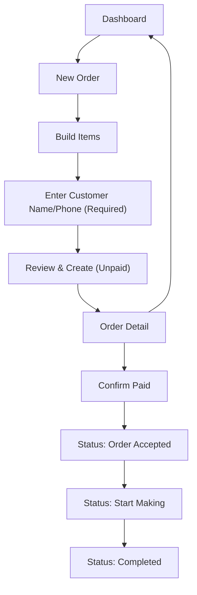

## 1. Product Overview
An admin-only web app for creating beverage orders, confirming payment, and manually progressing order status.
It streamlines counter workflow: capture customer details, take orders fast, confirm paid, then track production to completion.

## 2. Core Features

### 2.1 User Roles
| Role | Registration Method | Core Permissions |
|------|---------------------|------------------|
| Admin | None (local admin tool) | Create orders, confirm payment, set status, view/edit orders |

### 2.2 Feature Module
1. **Dashboard**: order list, search/filter, quick status updates
2. **New Order**: build order (items + quantities), capture customer identifier, review totals
3. **Order Detail**: payment confirmation, status management, receipt summary

### 2.3 Page Details
| Page Name | Module Name | Feature description |
|-----------|-------------|---------------------|
| Dashboard | Order list | List orders with key fields (customer, total, paid state, status, created time) |
| Dashboard | Filters | Filter by paid/unpaid and status; quick text search (name/phone/order id) |
| Dashboard | Quick actions | Jump to order detail; optional quick status change for paid orders |
| New Order | Order builder | Add/remove line items, set quantity, optional notes, auto-calc totals |
| New Order | Customer identification | Require either customer name or phone before proceeding to payment step |
| New Order | Review & create | Confirm summary and create order in “Unpaid” state |
| Order Detail | Payment step | Show amount due and “Confirm Paid” action (admin-only confirmation) |
| Order Detail | Status step | Manual status selection: “Order Accepted” → “Start Making” → “Completed” |
| Order Detail | Receipt summary | Read-only order breakdown; copy-friendly total for checkout |

## 3. Core Process
- Admin creates a new order by adding beverage items and quantities.
- Admin enters customer name or phone (required) before proceeding.
- Order is saved as “Unpaid”.
- In the order detail view, admin confirms the customer has paid by clicking “Confirm Paid”.
- After payment is confirmed, admin manually sets order status through the workflow: accepted → start making → completed.

## 4. User Interface Design

### 4.1 Design Style
- Theme: dark “counter terminal” aesthetic with crisp typography, high-contrast surfaces, and bold status color chips
- Primary color: deep ink / charcoal; Accent: electric lime + amber + cyan for states and interactions
- Buttons: high-contrast filled buttons with subtle glow; destructive actions in red
- Fonts: distinctive display font for headings; clean sans for data tables and forms
- Layout: desktop-first split layout (list on left, detail/preview on right on wide screens), card-based on smaller screens

### 4.2 Page Design Overview
| Page Name | Module Name | UI Elements |
|-----------|-------------|-------------|
| Dashboard | Order list | Dense table/list with status chips, paid badge, sticky header, keyboard-friendly focus styles |
| New Order | Order builder | Inline editable line items, quick-add presets, clear totals panel, step indicator |
| Order Detail | Payment + Status | Stepper showing “Unpaid → Paid → Production”, big “Confirm Paid” CTA, status timeline with manual selector |

### 4.3 Responsiveness
- Desktop-first for admin counter use
- Mobile-adaptive layout (stack list/detail), large tap targets for quick operation
