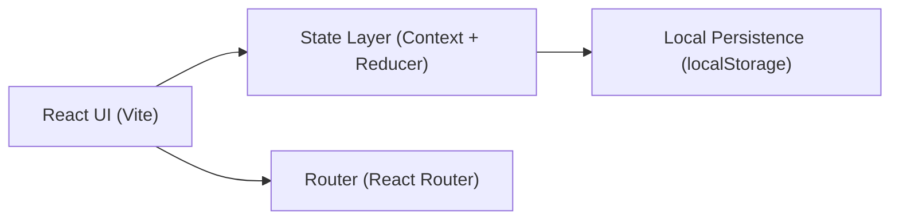
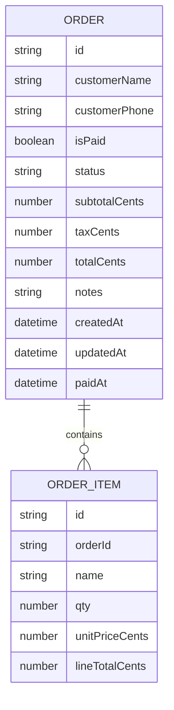

## 1. Architecture Design

## 2. Technology Description
- Frontend: React@18 + TypeScript + tailwindcss@3 + vite
- Initialization Tool: create-vite
- Backend: None (admin-only local tool)
- Data: localStorage (orders, settings); optional seed data on first run

## 3. Route Definitions
| Route | Purpose |
|-------|---------|
| / | Dashboard: order list, filters, open order detail |
| /new | New order: build items, customer info, create order |
| /orders/:id | Order detail: confirm payment, set status, view receipt |

## 4. API Definitions
No backend APIs. All actions are handled client-side:
- Create order
- Update customer info
- Confirm paid
- Update status
- Persist/load from localStorage

## 5. Data Model

### 5.1 Data Model Definition

### 5.2 Storage Schema (localStorage)
- Key: `beverage_admin_orders_v1`
- Value: JSON array of `ORDER` objects (each includes nested `ORDER_ITEM[]`)

## 6. Key Implementation Notes
- Guardrails:
  - Customer name or phone is required before enabling “Proceed to Payment”
  - “Confirm Paid” can only be done once (stores `paidAt`)
  - Status changes are allowed only after payment is confirmed
- Status enum:
  - `ACCEPTED` → `MAKING` → `COMPLETED`
  - UI shows friendly labels: “Order Accepted”, “Start Making”, “Completed”
